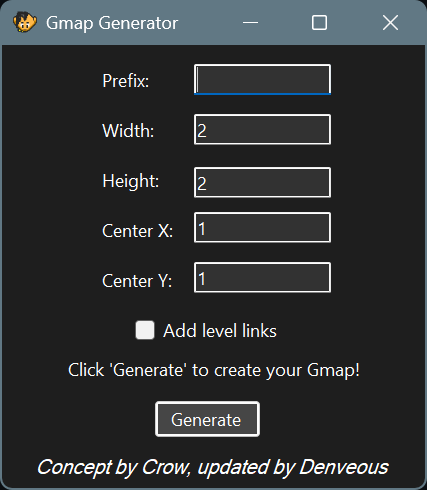

<h1 align="center">
   
  </a>
   
  <b>Gmap Generator</b>
   
</h1>

## Overview
This project is based around the initial code from Crow over on the [forums](https://forums.graalonline.com/forums/showthread.php?t=85656). This is designed to help you create gmap files & levels effortlessly. It generates the gmaps by either reading a `template.nw` file located in the same directory as the exe or a blank grass level if no `template.nw` is provided.

### You can download the gmap generator [here](https://github.com/Denveous/gmapgenerator/releases/download/winx64/GmapGenerator.exe).

---

### Prerequisites

- [.NET Runtime 6.0](https://builds.dotnet.microsoft.com/dotnet/WindowsDesktop/6.0.36/windowsdesktop-runtime-6.0.36-win-x64.exe)

